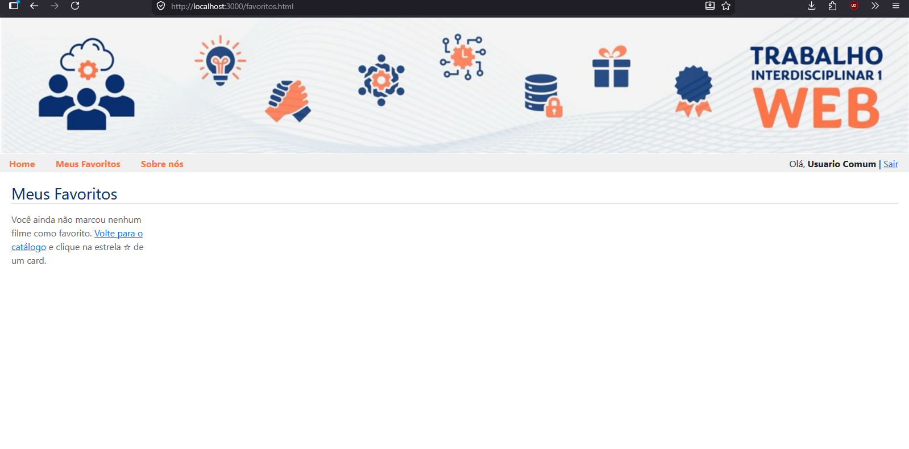
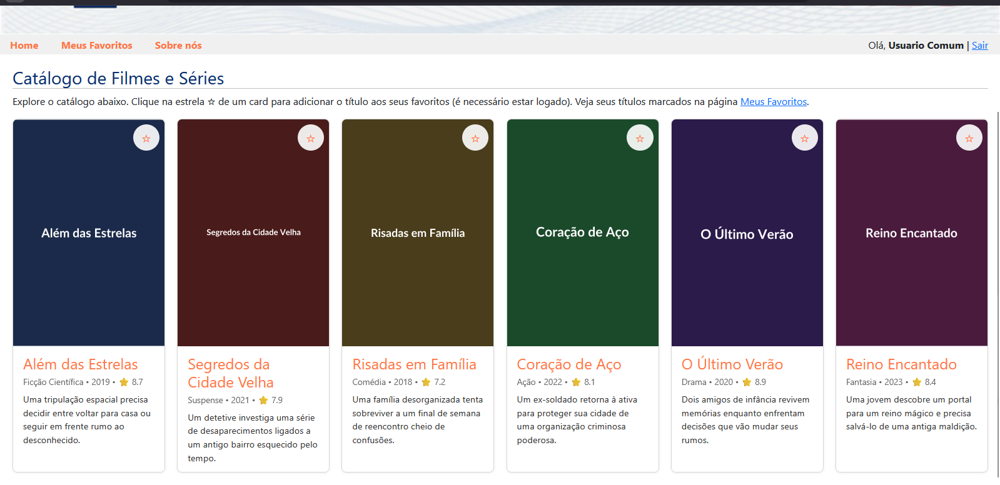

# Trabalho Prático - Semana 15

Nesta atividade, vamos integrar ao projeto o módulo de login, cujo código já é fornecido com o repositório compartilhado para a atividade. A partir dessa integração, vamos implementar uma funcionalidade adicional de personalização para marcação e exibição de itens favoritos.

## Informações do trabalho

- Nome: Erick Calixto
- Matricula: 924090

**Print da tela com a implementação**

Foi implementado um catálogo de filmes/séries na home-page (`codigo/public/index.html`), consumido via API REST do JSON Server (`/filmes` em `db.json`).

- **Login não bloqueante**: a home-page e as demais páginas podem ser acessadas sem login. No cabeçalho, a área `#userInfo` mostra o link "Entrar" quando ninguém está logado, ou "Olá, `<nome>` | Sair" quando há um usuário logado (implementado em `assets/js/login.js`).
- **Favoritos**: cada card de filme tem um botão "★/☆". Se o usuário não estiver logado, o clique é bloqueado, uma mensagem é exibida e ele é redirecionado para a tela de login (`assets/js/favoritos.js`). Se estiver logado, o filme é adicionado/removido da lista de favoritos.
- **Persistência por usuário**: os favoritos são salvos no `localStorage` com a chave `favoritos_<idDoUsuario>`, contendo um array de ids (ex.: `[1, 4]`). Isso garante que os favoritos continuem valendo após recarregar a página ou reabrir o navegador para aquele usuário.
- **Página "Meus Favoritos"** (`codigo/public/favoritos.html`): lista somente os filmes favoritados pelo usuário logado; se ninguém estiver logado, exibe um aviso com link para a tela de login.

